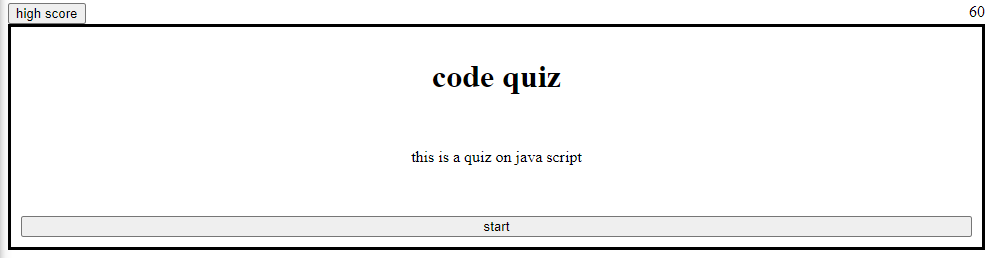

# DMCodeQuizWk4

https://miaodl4.github.io/DMCodeQuizWk4/

## Description

this is a JS quiz week four of bootcamp, main focus this is Web-APIs. 6 question, 60 seconds to do it, -10 second for every wrong question.

## Table of Contents 

- [Installation](#installation)
- [Usage](#usage)
- [Credits](#credits)
- [License](#license)

## Installation

N/A

## Usage

follow the buttons and enjoy

## Credits

N/a

## License

N/A
